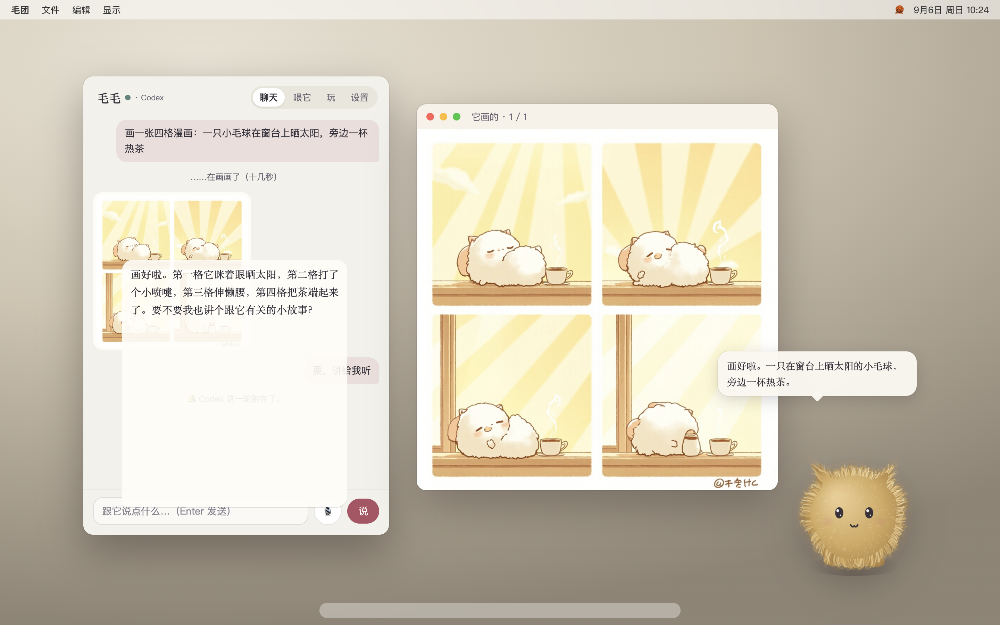
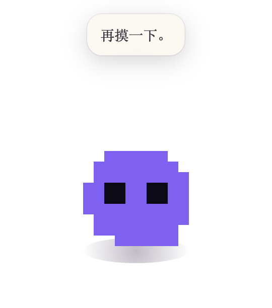
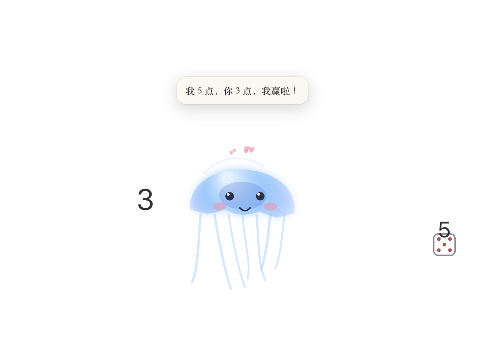
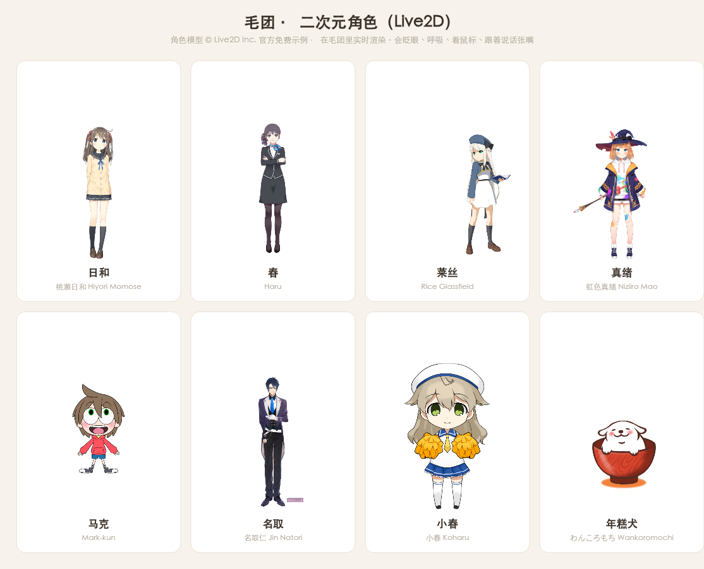
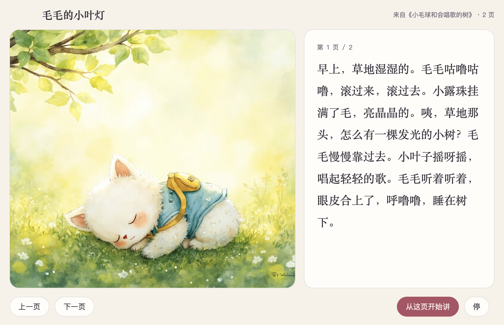
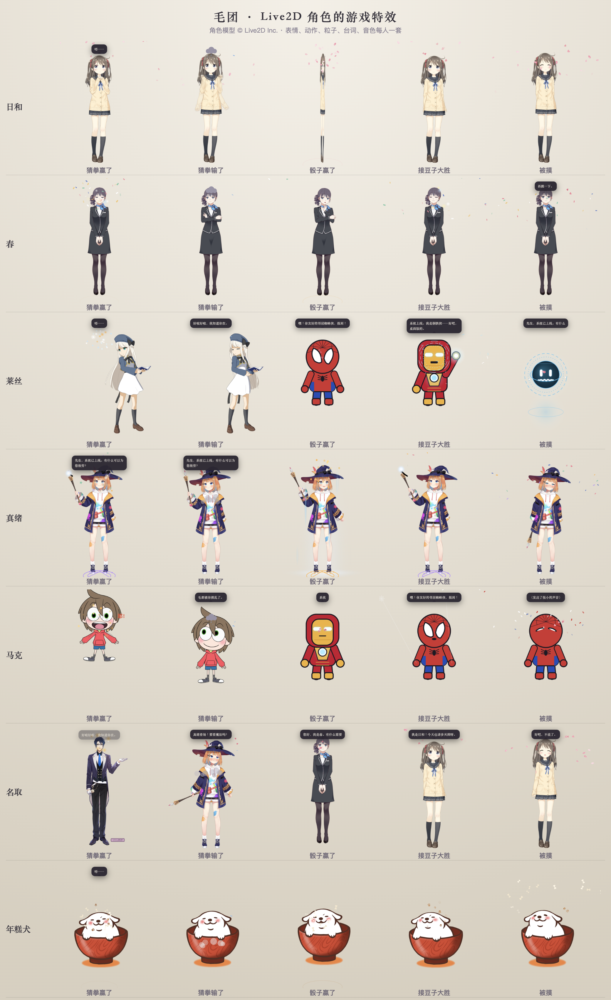

<p align="center">
  
</p>

<h1 align="center">毛团</h1>

<p align="center">一团住在桌面上的 AI 小伙伴。<br>
摸它会开心，抱起来腿会晃，甩出去会飞；会聊天、讲故事、读书给你听、画画、哼歌、陪你玩，还会盯着你的 Claude Code / Codex，跑完了来叫你。<br>
<sub>A fluffy desktop companion for macOS &amp; Windows, powered by Claude Agent SDK / OpenAI Codex SDK, MiniMax voice &amp; images, local Whisper, and MCP.</sub></p>

<p align="center">
  
  
  
</p>
<p align="center"></p>

---

## 它会什么

| | |
|---|---|
| **陪着你** | 住在桌面最前面，鼠标蹭它=摸，按住拖=抱走（腿会晃），甩出去会飞、撞屏幕边弹、落地压扁；发呆时打哈欠、伸懒腰、抖耳朵；你离开几分钟回来它会迎你 |
| **聊天** | 打字或**按住 🎙 说话**（本地 Whisper，离线）。它有人设、有自己的小本子（记你的喜好），说话有情绪，声音由 MiniMax 合成 |
| **读书** | 把 txt / md / pdf 或一段文字丢给它：一句一句念、记进度、讲导读、回答关于内容的问题 |
| **绘本** | 一篇故事 → 改写成给小朋友听的几页 → 每页一张水彩插画 → 绘本窗里一页一页讲 |
| **画画** | "画一张……"：插画 / 四格漫画 / 水彩 / 像素 / 写实，画好出现在聊天窗和画框里 |
| **唱歌** | 它自己写词，用自己的声音配着一段小旋律哼给你听 |
| **玩** | 猜拳、比大小（骰子）、接豆子——都在桌面上、在它身上演 |
| **接你的生活** | 本机「音乐」App、飞书、Slack、Notion、GitHub、Spotify、Google 日历+Gmail、网易云……任何 MCP 都能接 |
| **盯着你的 AI** | Claude Code 或 Codex 跑完一轮、或在等你确认时，它蹦起来叫你 |
| **18 套皮肤** | 手绘：毛团、水母、史莱姆、小幽灵、小机器人；像素：像素团、像素水母、像素猫、像素幽灵、像素机器人、像素史莱姆；**二次元 Live2D 角色**：日和、春、莱丝、真绪、马克、名取、年糕犬（见下，每位有自己的名字、反应、台词和音色） |

<p align="center">
  
  
</p>

## 二次元角色（Live2D）

除了手绘、像素和 Q 版皮肤，毛团还能变成真正的二次元立绘角色：**桃濑日和、春、莱丝、虹色真绪**（女生），**马克君、名取仁**（男生），外加一只**年糕犬**。它们是 Live2D 官方免费发布的示例模型，毛团用 Cubism Core + [pixi-live2d-display](https://github.com/guansss/pixi-live2d-display) 在透明窗口里实时渲染：眨眼、呼吸、头发和裙摆的物理、待机小动作、被摸时的反应动作都是模型自带的；看向鼠标、说话张嘴（跟着 MiniMax 的声音）、被摸脸红、困了闭眼、被拎起来晃、蹦跳、转圈、桌面小游戏是毛团接上去的。右键它 → 换个样子，或 设置 → 它的名字和样子。

- 第一次选中某个角色，会从 Live2D 官方 GitHub（失败则走 jsDelivr 镜像）把模型下到本机 `userData/live2d/`，每个 3–10 MB；引擎 Cubism Core 从 Live2D 官方 CDN 取。仓库和安装包里都不含这些文件，下载时它站的地方会显示进度。
- 版权：角色模型 © Live2D Inc.，按 [Live2D Free Material License](https://www.live2d.com/eula/live2d-free-material-license-agreement_en.html) 和[示例数据使用条款](https://www.live2d.com/eula/live2d-sample-model-terms_en.html)使用；名取仁是协作角色，仅限非商用。This content uses sample data owned and copyrighted by Live2D Inc. The sample data are utilized in accordance with terms and conditions set by Live2D Inc.
- 想接别的 Live2D 模型（Cubism 3 / 4 的 `.moc3`）：在 `renderer/skins/live2dCatalog.js` 加一条（目录名、model3.json 文件名、缩放），模型文件放进 `userData/live2d/<目录>/` 并在里面放一个空的 `.complete` 文件即可。

### 每个角色一套反应

**点它一下**，还有猜拳、骰子、接豆子的赢 / 输 / 平，被摸、落地、转圈——每个角色的反应都不一样，写在 `renderer/skins/live2dCatalog.js` 的反应表里：日和撒樱花、春放金彩带、莱丝召唤冰魔法阵、真绪的彩虹魔法和魔杖特效、马克的漫画集中线、名取推眼镜时镜片反光、年糕犬得意脸加骨头雨。表情、动作是 Live2D 模型自带的，粒子、光环、雨云、闪光、飘字是 `renderer/skins/fx2d.js` 画的。台词也各有各的口气（{it}{me} 是出的手势 / 点数），聊天时的说话风格会一并写进人设。

点它的反应每个角色有三四个变体轮着来（手绘和像素皮肤也有），连点五下会触发"别戳了"的特殊反应，之后三秒半内再点只轻轻弹一下，不会卡在暴走里。整张表在 `renderer/skins/tapTables.js`，是用 `scripts/merge-taps.py` 生成的——它会照着真模型核对每个特效名、粒子、锚点、Live2D 的动作 / 表情 / 参数，并强制"全屏闪不过 0.18、抖动不过 4 像素、第一帧必须看得见"。

<p align="center"></p>

### 音色也配好了

Live2D 角色说话用自己的 MiniMax 音色（设置 → 声音 里可以关掉，改用你挑的那个）：

| 角色 | 音色 | 角色 | 音色 |
|---|---|---|---|
| 日和 | 清脆少女 | 马克 | 可爱男童 |
| 春 | 甜美女声 | 名取 | 温润男声 |
| 莱丝 | 温暖少女（慢一点、低一点） | 年糕犬 | 憨憨萌兽 |
| 真绪 | 俏皮萌妹 | | |

换到某个角色时它会用自己的声音打个招呼；游戏结果的台词会带上开心 / 沮丧 / 惊讶的语气。

### 每个样子都有自己的名字和性子

不是所有样子都叫毛毛：毛团叫毛毛，水母叫小水，史莱姆叫果冻，小幽灵叫幽幽，小机器人叫滴滴，像素那几只叫方块、蓝蓝、橘子、小幽、哔哔、绿豆；Live2D 角色用各自的名字（日和、春、莱丝、真绪、马克、名取、年糕犬）。换样子的时候名字、说话风格、音色一起换，小本子里的记忆是共用的。设置 → 它的名字和样子 里改的是当前这个样子的名字，清空就恢复默认。

## 下载安装

去 [Releases](../../releases) 下载：

| 系统 | 文件 | 说明 |
|---|---|---|
| macOS（Apple Silicon） | `maotuan-x.y.z-mac-arm64.dmg` | 拖进「应用程序」。没有签名，第一次打开若提示"无法验证开发者"：**右键 → 打开**，或 系统设置 → 隐私与安全性 → 仍要打开 |
| Windows 10/11 x64 | `maotuan-x.y.z-win-x64-setup.exe`（安装版） / `…-portable.exe`（免安装） | SmartScreen 提示时点「更多信息 → 仍要运行」 |

打开后它出现在屏幕右下角；菜单栏 / 托盘里有个 🧶，退出也在那里。

## 怎么跟它玩

**点它不会弹窗。** 点一下就是逗它玩：每个角色有三四种不同的反应轮着来，连着点还会有"别戳了"的特殊反应，台词也是它自己的口气。要说话，用下面任意一种：

| 想干嘛 | 怎么做 |
|---|---|
| 打开聊天窗 | **右键它 → 和它聊聊**；或快捷键 `Alt+Shift+M`；或在设置里打开「连点几下打开聊天窗」（双击 / 三击 / 四击） |
| 直接开口说话 | 右键 → 对它说话；或快捷键 `Alt+Shift+V`（打开窗口并开麦） |
| 换样子、调大小、静音、设置 | 右键它，菜单里都有 |
| 摸它 | 鼠标在它身上蹭 |
| 抱走 / 扔出去 | 按住拖；甩得够快它会飞出去撞墙弹回来 |
| 转圈 | 双击 |
| 让它闭嘴 | 它说话时点它一下 |

两个快捷键都能在 设置 → 怎么叫出聊天窗 里改，留空就是不用。

> 语音输入需要电脑上装有 **Node.js 18+**（[nodejs.org](https://nodejs.org)）——识别跑在一个用系统 Node 起的子进程里，Electron 自带的 Node 跑不了 onnxruntime。其它功能不需要。

## 三分钟上手

第一次打开会有四步向导：起名字、选样子 → 接脑子 → 接声音 → 玩法。之后设置里可以「再看一遍」。

### 1. 脑子（二选一，不需要 API key）

| | 用什么登录 | 怎么弄 |
|---|---|---|
| **Codex**（默认） | 你电脑上的 `codex login` | 装 [Codex CLI](https://github.com/openai/codex)：`npm i -g @openai/codex`，终端里跑 `codex login` 登录 ChatGPT 账号 |
| **Claude** | 你电脑上的 Claude Code 登录 | 装 [Claude Code](https://code.claude.com)：`npm i -g @anthropic-ai/claude-code`，终端里打 `claude` → 输入 `/login`。也可以 `claude setup-token` 生成长期令牌贴进设置 |

两个脑子共用同一份人设、同一本小本子、同一批工具。它说「脑子没接上」，几乎都是没登录。

### 2. 声音（MiniMax）

1. 打开 [MiniMax 开放平台](https://platform.minimaxi.com)（国内）或 [国际站](https://platform.minimax.io)，注册、实名、充少量余额（聊天几乎不花钱）。
2. 「账户管理 → API Key」新建并复制。国内站的 key 不需要 GroupId（老版本 key 需要的话填「账户信息」里的 GroupId）。
3. 设置 → 声音：贴 key → **保存 key**。会自动检测国内 / 国际站。
4. 「拉取音色」→ 列表最上面是「推荐给毛团」（憨憨萌兽、萌萌女童、温暖少女……）→ 每行「试听」→「用这个」。语速、语调有滑杆。

没填 key 时用系统语音（macOS `say` / Windows System.Speech），能用但难听。念整本小说很费字数，可以把「念长文章时用」改成系统语音。

同一把 key 也用于画画（image-01，按张计费）。MiniMax 的**音乐接口自 2026-08-20 起不再对新账号开放**，所以"唱歌"默认是哼唱模式；老账号能用会自动改成真唱。

### 3. 它能碰的东西（MCP）

设置 → 「它能碰的东西」→「添加一个…」：

| 预设 | 要准备什么 |
|---|---|
| 本机「音乐」App | 自带，macOS 上开箱即用（只能放资料库里有的） |
| 飞书 / Lark | [飞书开放平台](https://open.feishu.cn) 建自建应用，拿 App ID / App Secret |
| Slack | Slack App 的 Bot Token（`xoxb-`），搜索要 User Token |
| Notion | Integration Token（`ntn_`） |
| GitHub | Personal Access Token |
| Spotify | 开发者后台建应用，Client ID / Secret |
| Google 日历 + Gmail | Google Cloud Console 建 OAuth 客户端（桌面应用），启用 Gmail API、Calendar API；第一次用弹浏览器授权；**只读** |
| 网易云音乐 | 本机装了网易云客户端；跑 `scripts/setup-netease.sh`，把打印的路径填进去；首次扫码登录 |
| 文件夹 | 让它读某个目录 |
| 自定义 | 任意 MCP：本地命令（stdio）或网址（http / sse） |

毛团**自己也是一个 MCP 服务**（`mcp/maotuan-tools.js`）：`remember`、`pet_say`、`pet_sing`、`draw_picture`、`pet_status`、`music_*`。WorkBuddy、Claude Code、Codex 这类客户端可以反过来接它，让它替它们说话：

```json
{ "mcpServers": { "maotuan": {
  "command": "/Applications/毛团.app/Contents/MacOS/毛团",
  "args": ["/Applications/毛团.app/Contents/Resources/app/mcp/maotuan-tools.js"],
  "env": { "ELECTRON_RUN_AS_NODE": "1", "MAOTUAN_DATA": "~/Library/Application Support/毛团", "MAOTUAN_PORT": "47831" }
} } }
```

### 4. 让它盯着你的 AI

设置 → 「让它盯着你的 AI」→「盯着」。它会在你确认后：

- 往 `~/.claude/settings.json` 的 hooks 加 `Stop` 和 `Notification` 两条，命令只是往本机 `127.0.0.1:47831` 发通知，不出网；
- 把 `~/.codex/config.toml` 的 `notify` 指向 `~/.maotuan/codex-notify.sh`——脚本先敲毛团，再执行你原来的 notify（不会丢）。

任何脚本都能让它说话：

```bash
curl -X POST http://127.0.0.1:47831/say -H 'Content-Type: application/json' -d '{"text":"跑完啦"}'
```

## 从源码运行 / 自己打包

需要 **Node.js 20+**、npm；macOS 打 mac 包，Windows 包在 macOS 上也能交叉打（不需要 wine）。

```bash
git clone https://github.com/stevenchengxy/maotuan.git
cd maotuan
npm install          # 会下载 Electron（国内慢的话：export ELECTRON_MIRROR=https://npmmirror.com/mirrors/electron/）
npm start            # 开发运行
npm run dist:mac     # → dist/*.dmg
npm run dist:win     # → dist/*-setup.exe, *-portable.exe
```

CI 配置在 `ci/build.yml`：`gh auth refresh -s workflow` 后把它移到 `.github/workflows/build.yml`，推到 GitHub 打 tag（`v0.5.0`）就会在 macOS 和 Windows 上各打一份。

开发时有几个环境变量方便调试：`MAOTUAN_SHOT=1`（把每个皮肤和面板截图到 `.shots/`）、`MAOTUAN_DEV=1`（详细日志）、`MAOTUAN_DEVCHAT="……"`（启动后自动聊一句）、`MAOTUAN_ICON=1`（把它渲染成应用图标）。外观规范在 `.claude/skills/fluff-art/SKILL.md`。

## 数据与隐私

- 所有东西都在本机：macOS `~/Library/Application Support/毛团/`，Windows `%APPDATA%\毛团\`——状态、小本子（`brain/memory.md`）、声音缓存、绘本、画、模型。
- API key 用系统钥匙串 / DPAPI 加密后存放，界面只显示尾号。
- 语音识别完全在本机，录音不上传。
- 出网的只有：你选的脑子（Claude / Codex）、MiniMax（合成语音、画图）、你自己接的 MCP。

## 常见问题

**它说"脑子没接上"** — Codex：终端跑 `codex login`；Claude：终端打 `claude` → `/login`。切换脑子在设置里。

**MiniMax 报 2049 invalid api key** — 站点不对。`sk-api-` 开头的通常是国内站的 key，点「检测这把 key」会自动切换。

**拉取音色只有一条报错** — 同上，先检测 key。

**语音输入没反应** — 电脑上要有 Node.js 18+；第一次会下载约 250MB 模型（国内走 hf-mirror.com，设置里可换）。系统要给毛团麦克风权限。

**Codex 说它有"图像生成技能"但什么都没画** — 旧版本的问题；现在它只会用 `draw_picture` 画。

**macOS 打不开，说无法验证开发者** — 未签名。右键 → 打开。

**想让它闭嘴** — 说话时点它、点气泡、聊天窗右上角 ✋、或 Esc。

## 技术上

Electron 44 · 主进程 ESM · 渲染层零依赖 Canvas 2D（18 套皮肤：`renderer/skins/`）· 脑子：[`@anthropic-ai/claude-agent-sdk`](https://www.npmjs.com/package/@anthropic-ai/claude-agent-sdk) / [`@openai/codex-sdk`](https://www.npmjs.com/package/@openai/codex-sdk) · 工具：[`@modelcontextprotocol/sdk`](https://www.npmjs.com/package/@modelcontextprotocol/sdk) · 语音识别：[`@huggingface/transformers`](https://www.npmjs.com/package/@huggingface/transformers) Whisper · 语音合成 / 画图：MiniMax T2A v2 / image-01。

## 许可

MIT
